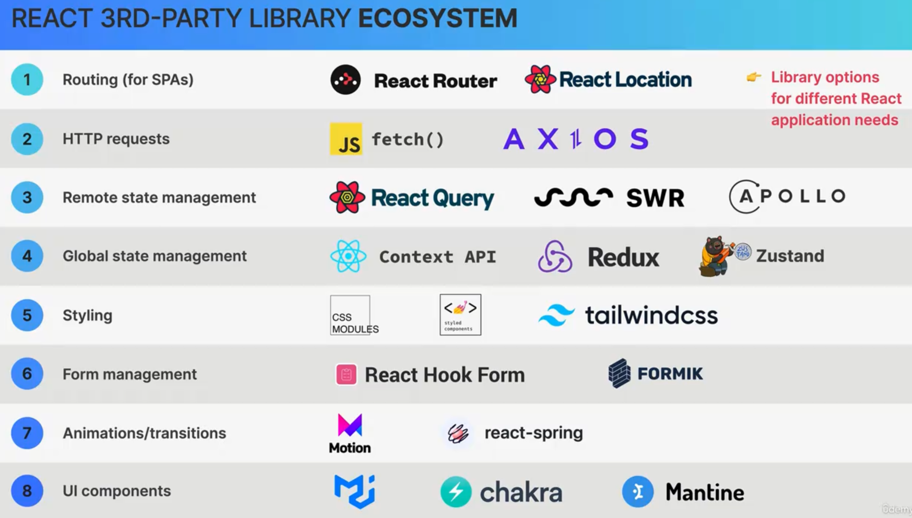

# react-projects

Notes
---State---
1.Date that a component can hold over time, informations need to remember througout the app's lifecycle.
2.component's memory
3.State variable/piece of state
4.updating the component state triggers React to re-render the component.
5.do not set state manually!

---mechanics of state---
State is preserved throughout re-renders

---react developer tools---

---update state based on current value---
put a callback in the set function:
setStep(step+1) ===> setStep((s)=>s+1)

---We view UI as a reflection of data changing over time---
for data that should not trigger component re-renders, DO NOT USE state. use a regular variable instead.

---State vs. Props---
State: internal data; owned by component.,make components interactive
Props:External data; owned by parent component;used by parent to configure child component

---Thinking In React---
Break the UI into components and establish the component tree
Build a static version in React(without state)
Think about State:when to use| local vs. global|Where to place each piece of state
Establish data flow: One-way|Child-to-parent communication|Accessing global state

---Fundamentals of State management---
Local State:
used only by one or few components
Global State:
many components might need

---share state with simbling component---
need to lift state up to parent component.
use setMethod in child component to update state in parent component.

---Derived state---
state that is computed from an existing piece of state or from props

Part2
p4:---Component Size Matters---
\*if the size of a component is huge
-Too many responsibilities
-Might need too many props
-Hard to reuse
-Complex code, hard to understand

\*if the size is too small
-end up with 100s of mini-components
-Confusing codebase
-Too abstracted(Creating something new to hide the implementation details of that thing)

\* Generally, we need to find the right balance between too specific and too broad.

\* How to splict a UI into Components?
-Logical separation of content/layout
-Some are reusable
-Low complexity
-Personal coding style

-Whne in doubt, start with a relatively big component, then split it into smaller components as it becomes necessary(unless you're sure you need to reuse).

-creating a new component means creating a new abstraction, try not to create new compnents too early.
-Name a component accoring to what it does or what it displays. do not afraid of using long component names.
-Co-locate related components inside the same file. Do not separate components into different files too early

P6: Component categories

\*Stateless/presentational components
-No State
-can receive props and simply present received data or other content
-Usually small and reusable

\*Stateful components
-Have State
-Can still be reusable

\*structural components
-Pages,layouts,or screens of the app
-result of composition
-can be huge and non-reusable(but don't have to)

P6: Prop Drilling

\* need to pass some props through several nested child components in order to get that data to deeply nested components.

P7: Componnent Composition

\* if we nest a child component into a parent component directly, we cannot❌ reuse the parent again. but if we pass it as children components between open and close tag, we can✅ still reuse the parent component.

\* we can use this to fix prop drilling problems

P11: Use explicit prop as alternative
-just use an customised name like {element} instead of {children}. then in the parent component, pass the prop explicitly, example:
<Box element={<MovieList movies={movies}>}/>

P16: PropTypes
it can be used to limit the type that pass to the component. but not used nowadays:
Example:
StarRating.propTyoes={
maxRating:PropTypes.number,
color:PropTypes.string
}

P28:
**Key Prop**
❗️always use key.
especially when rendering lists of components or elements.
key allows the react to tell the difference between component instant.
for example, if we add a new component in <ul>, the original children components will not be modified in DOM.

P31: Rules for render logic pure components
😂side effect: interaction with the outside world/ modification of any data outside the function scope.

🎇side effects are not bad! A program can only be useful if it has some interaction with the ourside world.

😁pure function:
1.Does not change any variables outside its scope;
2.Given the same input, a pure function always returns the same output;

Render Logic requires components be pure;

P32: State Update Batching
just one render and commit per event handler. even update multiple states.

P33: If we want to update the value of state based on the previous value, always use 🔥🔥callback function, For example:
setLikes((likes)=>likes +1);

P35 framework vs. Library
Framework --- ALl-in-one-kit
-Angular(include everything)

Libarary --- Separate ingredients
-React ("View" libarary) can use external 3rd-party libraries to build a complete application
-so need to research, download, learn and stay up-to-date with multiple external libraries.

Frameworks built on Top of react:
Next.js | Remix | Gatsby
🎇They are Full-stack frameworks

P36
1️⃣A component is like a blueprint, when use a component, React creates a component instance.
2️⃣ Each time a component instance is rendered and re-rendered, the function is called again, only the initial app render and state updates can cause a render, which happens for the entire application, not just one single component.
3️⃣ When a component instance gets re-rendered, all its children will get re-rendered as well.
4️⃣ Diffing is how React decides which DOM elements need to be added or modified. position in the element tree matters.
5️⃣Always add key props.
6️⃣Never declare a new component inside another component!
7️⃣compoent is not allowed to produce any side effects....

Part II Section 3

P38 Component(instance) LIFECYCLE🛟
🐣Mount/Initial Render
🐓Re-Render(When State| Props| Parent re-renders| Context Changes)
💀Unmount(component instance is destroyed and removed)

P39
shows a problem that when the Movies state was changed, the component will be re-renderd. if it was re-rendered, the fetch method will fire out request to the API, it is a infinite loop.

export default function APP(){
const[movies,setMovies]=useState([]);
fetch('API').then((res)=>res.json()).then((data)=>setMovies(data.search))
}

P40 Use useEffect to the Rescue

import useEffect from 'react';
useEffect(function(){
fetch('API').then((res)=>res.json()).then((data)=>setMovies(data.search))
},[]);

P41 use Effect to keep a component synchronized with external system( for example:API data )

P45 What is the useEffect Dependency array?
🔥Every state variable and Prop used inside the effect MUST be included in the dependency array.
🔥useEffect is a SYNCHRONIZATION mechanism. Whenever a dependency changes, it will execute the effect again. and component is re-rendered, so Effects and component lifecycle are deeply connected.
🔥if it has no props in the second postion, useEffect will run every time when any states or props are modified.
🔥if it has a empty array [] as props. it will only run at the initial mount.

Part III
P57. Hooks rely on call orders. so hoops can only called on top level⬆️, not in conditional, loop, nested component.

P59 More details of useState:
the initial value we pass to the useState only matters at initial render.🎬
For example, we can use a callback function to return the data we stored in localStorage in useState(callback), it will only be rendered at the initail render.

P65 useRef
it can preserve data between renders but not trigger re-render.
while state will preserve data but trigger re-render when updates.
normal const variable can not preserve data between renders but can trigger re-render.
-so use ref to store DOM element or data not rendered in JSX.

P66 custom hooks needs to use one or more hooks.
when you want to create some reuseable logic that involved hook, you can create custom hooks.
function name needs to start with use
can receive and return any relevant data(usually [] or {})

P71 optional--class component. people write component as classes before.

P74 main difference betweeen class component and function component

Part 3
useReducer hook:
P5,when it comes to many states, we choose useReducer for complex state and related pieces of state.
const [state,dispatch]= useReducer(reducer,initialState);

-reducer is a pure function that returns next state by taking current state and action.it contains logic to update stae. Decouples state logic from component.
-action:ojbect that describes how to update state
-dispatch:function to trigger state updates, by sending actions from event handlers to the reducer.

dispatch requests the update,
reducer makes the update,
state needs to be updtaed
action shows how to update the state.

add "server": "json-server --watch data/questions.json --port 8000" in package.json.
and use "npm run server" to hold this api.
-"rfc" can be used to initial the component

P20 create a new APP worldWise by using react router and vite.
-each time create a vite, should config the eslink by using following command.
-👩🏻‍💻npm install eslint vite-plugin-eslint eslint-config-react-app --save-dev

P21 With routing, we match different URLs to different UI views (React components): routes
-which allows users to navigate between different applications screens, using the browser URL.
-Keeps the UI in sync with the current browser URL.
-Allow us to build SPA (Single Page Application)
--SPA is executed entirly on the client(browsers), so never reloade, JavaScript is used to update the page(DOM)
--Feels like a native app
--additional data might be loaded from a web API

P24 Styling option
CSS Modules scope is component,
tailwindcss is getting popular.
use UI libraries like MUI,Chakra UI, Mantine, etc. pre build css

P25 We Choose to use CSS modules.
